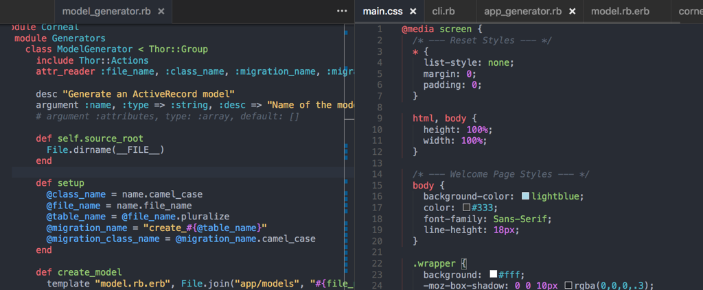

# One Monokai Theme
A cross between Monokai and One Dark theme

## Install

press `ctl/command + shift + p` to launch the command palette then run
```
ext install one-monokai
```

## Screenshot
Screenshot of Ruby and CSS



Available at [Visual Studio Code Marketplace](https://marketplace.visualstudio.com/items/azemoh.one-monokai)

## Changelog

#### v 0.1.2

  - Syntax highlight for embeded string.
