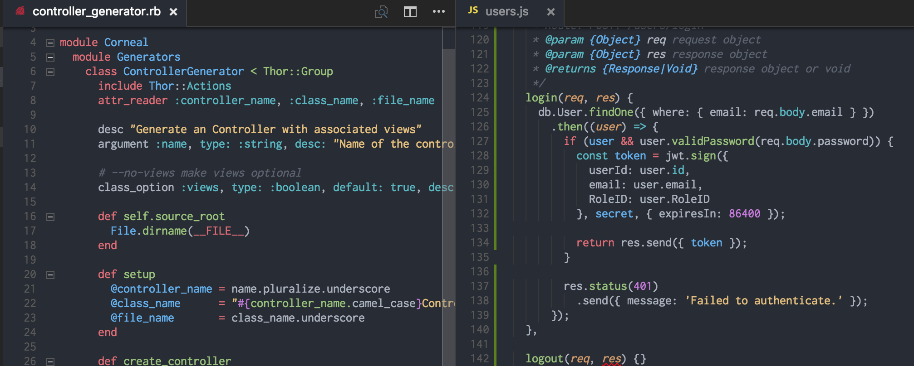

# One Monokai Theme

A cross between Monokai and One Dark theme

[](https://github.com/acekyd/made-in-nigeria)  [](https://marketplace.visualstudio.com/items?itemName=azemoh.one-monokai) [](https://marketplace.visualstudio.com/items?itemName=azemoh.one-monokai) [](https://marketplace.visualstudio.com/items?itemName=azemoh.one-monokai) [](https://github.com/azemoh/vscode-one-monokai)


## Install

press `ctl/command + shift + p` to launch the command palette then run
```
ext install one-monokai
```

## Screenshot
Screenshot of Ruby and JavaScript



If you like this theme checkout [One Dark Theme](https://marketplace.visualstudio.com/items?itemName=azemoh.theme-onedark)

## Change log
You can take a look at the change log [here](https://github.com/azemoh/vscode-one-monokai/blob/master/CHANGELOG.md)
